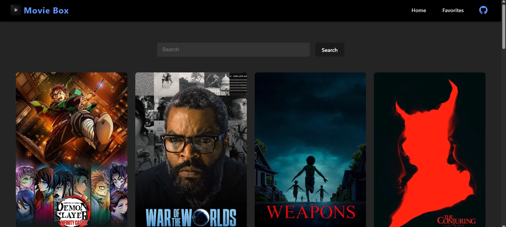
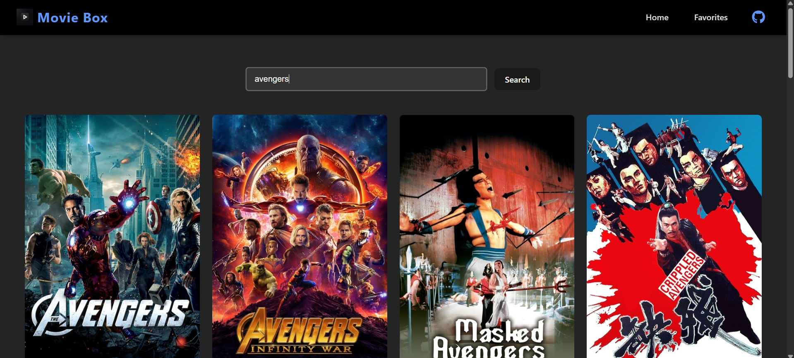

# Movie Box

  
  
  

A React web app for searching movies, viewing details, and managing your favorite films using The Movie Database (TMDb) API.

## Features

- Search for movies by title with instant results.
- Add movies to your favorites by clicking the heart icon.
- View a curated favorites page with all saved movies.
- Movie cards display rich information including posters and titles.
- Responsive, dark-themed UI for enjoyable browsing.

## API Integration

This app uses [The Movie Database API (TMDb)](https://www.themoviedb.org/documentation/api) for movie data.

- Requires an API key from TMDb, which you can get by creating an account at https://www.themoviedb.org/.
- The API provides detailed movie information, posters, credits, and recommendations.

### Important API Endpoints Used

- **Search Movies**  
  `GET https://api.themoviedb.org/3/search/movie?api_key=<<api_key>>&query=<<search_query>>`  
  Searches for movies matching the query.

- **Movie Details**  
  `GET https://api.themoviedb.org/3/movie/{movie_id}?api_key=<<api_key>>`  
  Retrieves detailed info about a specific movie.

- **Movie Credits**  
  `GET https://api.themoviedb.org/3/movie/{movie_id}/credits?api_key=<<api_key>>`  
  Fetches cast and crew info for a movie.

## Getting Started

1. Clone this repository:
