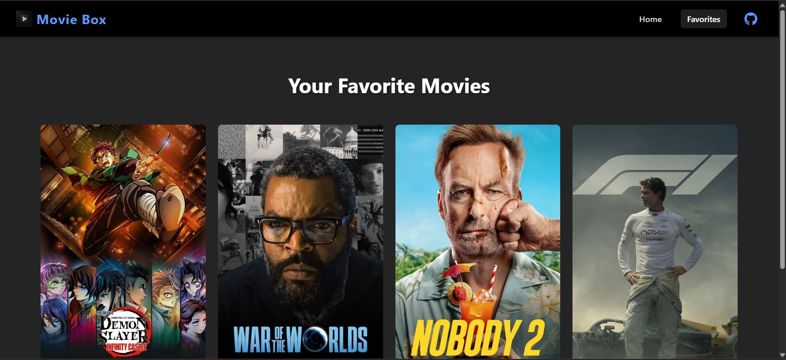

# Movie Box

  
  
  

A React web app for searching movies, viewing details, and managing your favorite films using The Movie Database (TMDb) API.

## Features

- Search for movies by title with instant results.
- Add movies to your favorites by clicking the heart icon.
- View a curated favorites page with all saved movies.
- Movie cards display rich information including posters and titles.
- Responsive, dark-themed UI for enjoyable browsing.

## API Integration

This app uses [The Movie Database API (TMDb)](https://www.themoviedb.org/documentation/api) for movie data.

- Requires an API key from TMDb, which you can get by creating an account at https://www.themoviedb.org/.
- The API provides detailed movie information, posters, credits, and recommendations.

### Important API Endpoints Used

- **Search Movies**  
  `GET https://api.themoviedb.org/3/search/movie?api_key=<<api_key>>&query=<<search_query>>`  
  Searches for movies matching the query.

- **Movie Details**  
  `GET https://api.themoviedb.org/3/movie/{movie_id}?api_key=<<api_key>>`  
  Retrieves detailed info about a specific movie.

- **Movie Credits**  
  `GET https://api.themoviedb.org/3/movie/{movie_id}/credits?api_key=<<api_key>>`  
  Fetches cast and crew info for a movie.

## Getting Started

1. Clone this repository:
`git clone https://github.com/<your-username>/<repo-name>.git
cd <repo-name>`

2. Install dependencies:
`npm install`

3. Run the development server:
`npm run dev`

4. Open your browser to `http://localhost:5173` to view the app.

## Usage

- Use the search bar on the Home page to find movies.
- Click the heart button on movie cards to add or remove favorites.
- Navigate to the Favorites page to view your saved movies.

## Folder Structure
``my-movie-app/
├── public/
│   ├── site-icon.png
│   └── vite.svg
├── services/
│   └── api.js
├── src/
│   ├── assets/
│   │   └── react.svg
│   ├── components/
│   │   ├── MovieCard.jsx
│   │   └── NavBar.jsx
│   ├── context/
│   │   └── MovieContext.jsx
│   ├── css/
│   │   ├── App.css
│   │   ├── Favorites.css
│   │   ├── Home.css
│   │   ├── index.css
│   │   ├── MovieCard.css
│   │   └── NavBar.css
│   ├── pages/
│   │   ├── Favorites.jsx
│   │   └── Home.jsx
│   │   └── intex.css
│   ├── App.jsx
│   └── main.jsx
├── .gitignore
├── package.json
├── README.md
└── vite.config.js``

## Technologies Used

- React with Vite build tool  
- React Router for routing  
- React Icons for iconography  
- TMDb API for movie data  

## Contributing

Open to community contributions. Fork the repo, make your changes, and open a pull request.

## License

This project is licensed under the MIT License.

---

Happy movie browsing! Feel free to contribute or open issues if you find bugs or want new features.

